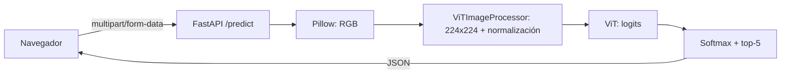

# GuessTheObject AI

Web app de Computer Vision: subes una imagen y un Vision Transformer
preentrenado identifica el objeto y devuelve el top 5 con su confidence.


## Qué hace

- Sube una imagen desde el navegador
- El backend la preprocesa y hace inference con `google/vit-base-patch16-224`
- Devuelve las 5 predicciones más probables con su confidence
- Todo se ejecuta en local, sin APIs de pago

## Arquitectura



## Modelo

`google/vit-base-patch16-224`: Vision Transformer de ~86M parámetros,
preentrenado en ImageNet-1k (1000 clases). Se usa solo para inference.

## Tecnologías

Python, PyTorch, Hugging Face Transformers, Pillow, FastAPI, Pydantic,
HTML/CSS/JavaScript, Docker, pytest.

## Instalación

```bash
git clone https://github.com/TU-USUARIO/guess-the-object.git
cd guess-the-object
python -m venv .venv
.venv\Scripts\activate
pip install -r requirements.txt
```

## Ejecución

```bash
uvicorn app.main:app --reload
```

Abre http://127.0.0.1:8000. La documentación interactiva está en `/docs`.

### Con Docker

```bash
docker build -t guess-the-object .
docker run -p 8000:8000 guess-the-object
```

## API

| Método | Endpoint   | Descripción                          |
| ------ | ---------- | ------------------------------------ |
| GET    | `/health`  | Comprueba que el servidor está vivo  |
| POST   | `/predict` | Recibe una imagen, devuelve el top 5 |

Ejemplo:

```bash
curl -X POST -F "file=@test.jpg" http://127.0.0.1:8000/predict
```

Respuesta:

```json
{
  "predictions": [
    { "label": "tabby, tabby cat", "confidence": 0.4208 },
    { "label": "tiger cat", "confidence": 0.2768 }
  ]
}
```

## Tests

```bash
pytest
```

## Limitaciones

- Solo reconoce las 1000 clases de ImageNet; ante algo fuera de ellas
  devuelve igualmente la clase más parecida.
- El confidence es la probabilidad softmax entre esas 1000 clases,
  no una garantía de acierto.
- Clases muy cercanas (por ejemplo, tipos de gato) se reparten la probabilidad.

## Posibles mejoras

- Modo juego con objetivos y puntuación
- Arrastrar y soltar imágenes
- Soporte para otros modelos
- Desplegar en la nube
